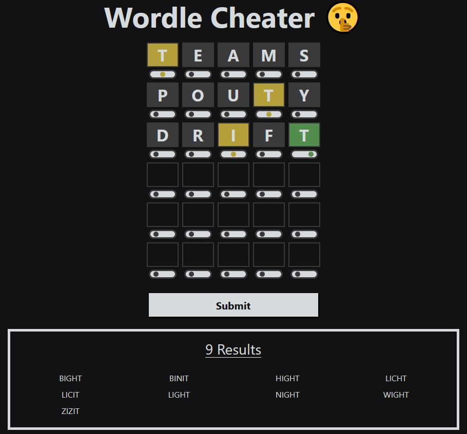

# Wordle Cheater

## About

Using all of the five-letter words in the Scrabble dictionary as its source, this webapp will filter and display the words that match a given Wordle board's rules. It was made using Svelte and Bootstrap.

## How to Use

1. Enter your guesses from your Wordle board.
2. Use the button beneath each tile to toggle its color.
3. Press the submit button to find all of the possible solutions.

## Screenshot

